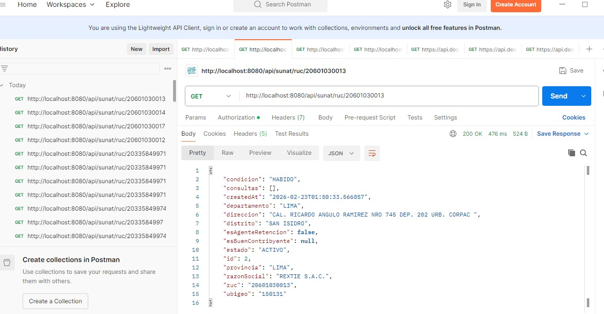
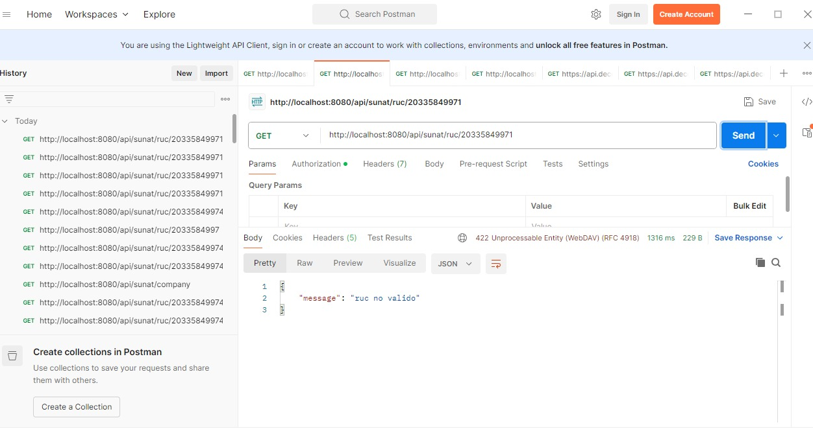

# 1. Como correr el proyecto
Clonar el proyecto con git clone
Configurar base de datos con usuario y contraseña dentro del application.properties
Ejecutar el proyecto con maven

# 2. Como configurar DECOLECTA_TOKEN
Ir a src>main>resource y dar click en application.properties
Dentro asignar el valor de tu token en la variable "decoleta.token"

# 3. Scripts de ejemplo
Endpoints disponibles:
GET http://localhost:8080/api/sunat/ruc/<ruc>
dentro de <ruc> debe ser reemplazado por el numero de RUC que deseas consultar, debe tener 11 digitos

# 4. Evidencia RUC VALIDO

# 5. Evidencia RUC INVALIDO
